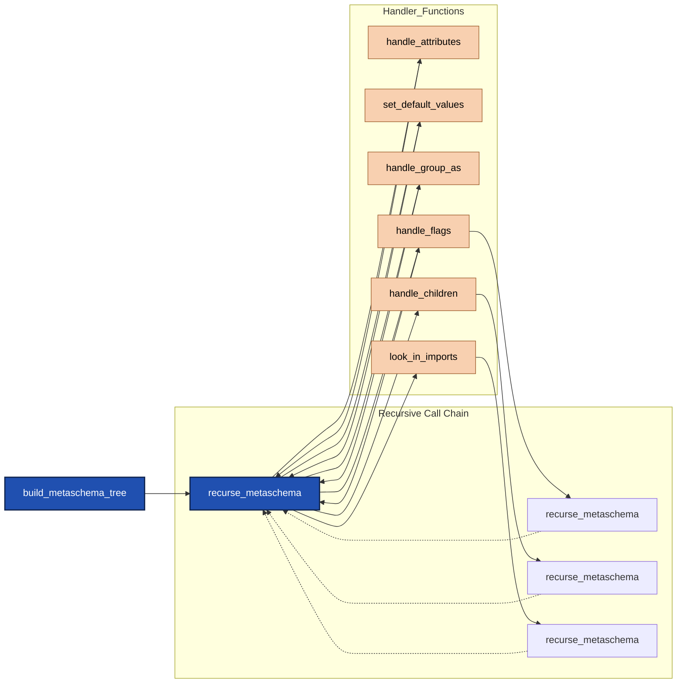

# Metaschema Parsing

## Metaschema Tree
The metaschema tree is a recursive dictionary representing a fully resolved metaschema definition.  
Each assembly, flag and field is represented by a metaschema node. The node structure is identical with some fields unused in certain scenarios.

The hierarchy of nodes is built with the top metaschema node representing the OSCAL model's root element. 
Each flag is represented by its own metaschema node and stored in the `flags` array. 
Each child field or assembly is represented by its own metaschema node and stored in the `children` array. 
The pattern repeats as needed until the entire model is represented.

```
assembly (root level metaschema node)
|
+- flags: (array of metaschema nodes. One for each flag.)
|  |
|  + flag (metaschema node)
|  + flag (metaschema node)
|
+- children: (array of metaschema nodes epresenting fields and assemblies)
   |
   + assembly [metaschema node - repeat assembly pattern from top]
   | 
   +- field (metaschema node)
      |
      +- flags
         |
         + flag
         + flag

```

## Metaschema Node: Key Names and Values

| Key Name              | Type     | Values / Example Values                                  | Default      | Description |
|-----------------------|----------|----------------------------------------------------------|--------------|-------------|
| path                  | string   | Example: "/model_name/x/y/z"                             |              | XML xPath   |
| use-name              | string   | token                                                    |              |             |
| name                  | string   | token                                                    |              |             |
| structure-type        | string   | "assembly", "field", "flag", "choice", "recursive"       |              |             |
| datatype              | string   | token: must be a metaschema data type                    | "string"     |             |
| min-occurs            | string   | "[non-negative-integer]"                                 | "0"          |             |
| max-occurs            | string   | "[non-negative-integer]" or"unbounded"                   | "1"          |             |
| default               | variant  |                                                          |              |             |
| pattern               | string   |                                                          |              | regex pattern |
| formal-name           | string   |                                                          |              |             |
| wrapped-in-xml        | string   | "WRAPPED", "UNWRAPPED", "WITH_WRAPPER"                   | "WRAPPED"    |             |
| group-as              | string   | token                                                    |              |             |
| group-as-in-json      | string   | "ARRAY", "SINGLETON_OR_ARRAY", "BY_KEY"                  |              |             |
| group-as-in-xml       | string   | "GROUPED", "UNGROUPED"                                   |              |             |
| json-array-name       | string   | "json_key"                                               |              |             |
| json-value-key        | string   |                                                          |              |             |
| json-value-key-flag   | string   |                                                          |              |             |
| json-collapsaible     | boolean  | True, False                                              | False        |             |
| depreciated           | boolean  | True, False                                              | False        | If @depreciated is present and this verison is >= the depreciated version, this is set to True. |
| sunsetting            | string   | version                                                  |              | If @depreciated is present, but this versiion is less than the depreciation target, this includes the version number when depreciation takes effect. |
| identifier-persistence | string | "per-subject" | |  |
| identifier-scope | string | "cross-instance" | | |
| identifier-type | string | "human-oriented", "machine-oriented" | | |
| identifier-uniqueness | string | instance | | |
| value-type | string | "identifier", "identifier-reference" | | |
| sequence              | integer  |                                                          |              | As the tree is built from the definition, this representes the sequence in which this node was created. Used to ensure correct XML sequencing. |
| source                | array    | [string, ...]                                            |              | The metaschema file where the reference and/or definition is found. May include one file for the definition and a different file for the reference. |
| props                 | array    | [{"name": {"value": "string", "namespace": "uri"}} ]     |              | Any props found in the metaschema definition |
| description           | array    | [string, ...]                                            |              | Array includes entries for the defined description and referenced description where both are present. |
| remarks               | array    | [string, ...]                                            |              | Array includes entries for the defined remarks and referenced remarks where both are present. |
| example               | array    | [string, ...]                                            |              | Array includes entries for the defined example and referenced example where both are present. |
| flags                 | array    | [dict, ...]                                              |              | Array of flags for this field or assembly. Each item in the array uses the same metaschema node structure. Not valid when this node is a flag. |
| children              | array    | [dict, ...]                                              |              | Array of fields or assemblies that are children to this assembly. Each item in the array uses the same metaschema node structure. Not valid when this node is a field or flag. |
| constraints           | array    | [ -TBD- ]                          |              | Array of defined constraints that apply to this node. |


## Rules Structure

| Key Name        | Type     | Values / Example Values                 | Default   | Description      |
|-----------------|----------|-----------------------------------------|-----------|------------------|
| id              | string   | "rule_id", UUID                         |           | Unique identifier for the rule. If not present, assign a UUID.                                  |
| level           | string   | "CRITICAL", "ERROR", "WARNING", "INFORMATIONAL", "DEBUG"  | "ERROR"   | Severity level of the rule. Defaults to "ERROR" if not specified.             |
| name            | string   | "rule_name"                             |           | Short name for the rule.                                                                        |
| formal-name     | string   | "formal_name"                           |           | Formal name for the rule.                                                                       |
| rule-type       | array    | ["let", "allowed-values", "expect", "has-cardinality", "index", "index-has-key", "is-unique", "matches"] |   | One or more types describing the rule's function. |
| datatype        | string   | "string"                                |           | Data type the rule applies to.                                                                  |
| default         | string   | "default_value"                         |           | Default value for the flag or field.                                                            |
| pattern         | string   | "regex_pattern"                         |           | Regular expression pattern the value must match.                                                |
| allowed-values  | dict     | {"value": "value text", ...}            |           | List of allowed values for the field or flag.                                             |
| allow-others    | boolean  | True, False                             |           | Whether values outside `allowed-values` are permitted.                                          |
| extensible      | string   | "none", "model", "external"             | "model"   | Indicates if the rule is extensible and how.                                                    |
| test            | string   | "metapath-string"                       |           | Metapath expression used for testing the rule.                                                  |
| index-key       | object   | {"target": "string", "pattern": "string", "remarks": "string"} |           | Index key definition, with target (xpath), pattern (regex), and remarks. |
| message         | string   | "string"                                |           | Message to display when the rule is triggered.                                                  |
| source          | object   | {"organization": "string", "url": "string", "version": "string"} |           | Source information for the rule.                                       |
| context         | array    | ["/model_name/x/y/z", "/model_name/a/b/c"] |           | Context paths where the rule applies.                                                        |
| target          | string   | "./p/d/q"                               |           | Target path for the rule.                                                                       |
| help-url        | array    | ["uri", "uri"]                          |           | URLs for additional help or documentation.                                                      |
| help-text       | array    | ["string", "string"]                    |           | Help text strings for the rule.                                                                 |
| min-occurs      | string   | "0"                                     | "0"       | Minimum number of occurrences.                                                                  |
| max-occurs      | string   | "unbounded"                             | "1"       | Maximum number of occurrences.                                                                  |
| depreciated     | boolean  | True, False                             | False     | True if the rule is deprecated in this version or later.                                        |
| sunsetting      | string   | "version"                               |           | Version when the rule will be sunset (if applicable).                                           |
| let             | object   | {"var-name": "expression-value", ...}   |           | Variables defined by let statements for this context.                                           |
| props           | array    | [{"name": {"value": "string", "namespace": "uri"}} ] |              | Any props found in the metaschema definition                                    |
| description     | string   | "description"                           |           | Human-readable description of the rule.                                                         |
| remarks         | string   | "string"                                |           | Additional remarks about the rule.                                                              |

```json
        rules = {"id": "rule_id", (if no ID present, assign a UUID)
                "level": ["CRITICAL", "ERROR", "WARNING", "INFORMATIONAL", "DEBUG"], (when not specified, default to ERROR)
                "name": "rule_name",
                "formal-name": "formal_name",
                "description": "description",
                "rule-type": ["let", "allowed-values", "expect", "has-cardinality", "index", "index-has-key", "is-unique", "matches"], (array: one or more)
                "data-type": "string",
                "default" : "string, # a default value for the flag or field
                "pattern": "string", (regex pattern)
                "allowed-values": [ {"value": "value2", "text": "string"}, {} ],
                "allow-others": [ True | False ],
                "extensible": ["none", "model", "external"],  (default: model)
                "test": "metapath-string",
                "index-key": {"target": "string", "pattern": "string", "remarks": "string"}, (target is xapth, pattern is a regex pattern)
                "message": "string",
                "source": {"organization": "string", "url": "string", "version": "string"},
                "context": ["/model_name/x/y/z", "/model_name/a/b/c"],
                "target": "./p/d/q",
                "help-url": ["uri", "uri"],
                "help-text": ["string", "string"],
                "min-occurs": "0",
                "max-occurs": "unbounded",
                "depreciated": True, (If metaschema @depreciated is present and this verison is >= the depreciated version, this is set to True.)
                "sunsetting": "version", (If metaschema @depreciated is present, but this versiion is still valid, use the sunsetting version.)
                "let": ["var-name": "expressioon-value", "var-name": "expressioon-value"], (as defined by the let statements for this context.)
                "props": ["name": {"value": "string", "namespace": "string"}, {}],
                "remarks": "string"
                }
```

### Indexes


```JSON
indexes = {}

```


## Data Structure

```json
document = {"model" : "name",
            "tree" :  {
                "path" : "",
                "data" : [oscal_data_type | ]
            }
}

```
- `path` links back to metaschema_tree
  - Used to identify:
    - field, flag or assembly
    - data type (if field or flag)
    - array (JSON name if appropriate)
    - cardinality
    - rules/constraints
  - Ordinal values are unnecessary
    - Path is only used to tie into metaschema info

## Metaschema Parsing Modules

Once the MetaschemaParser object is instantiated with a Metaschema definition, 


The following annotates the logic flow between modules as the Metaschema definition is traversed through all trees across all imported metachema files.


